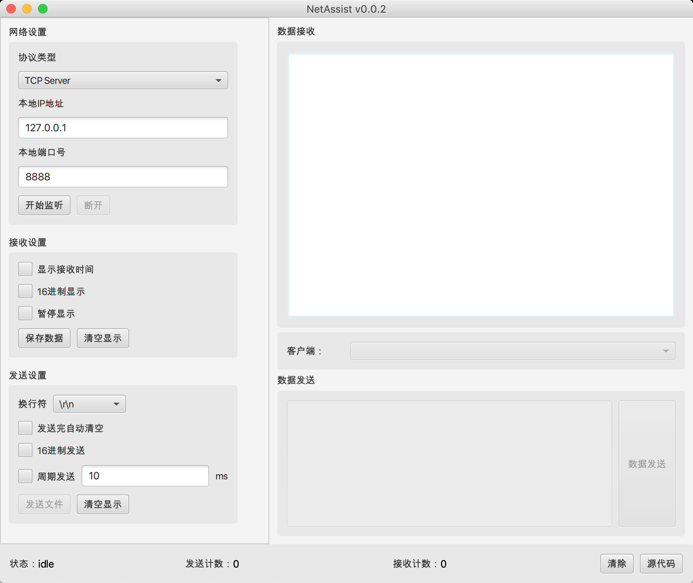

# NetAssist网络调试助手

***参考自：[https://github.com/nicedayzhu/netAssist](https://github.com/nicedayzhu/netAssist)***

在jvm上运行的跨平台网络调试助手

##  运行环境
含有javafx的jre8,`java11+`,不支持`java9`和`java10`

##  功能说明
1.  UDP 数据收发
1.  TCP Client/Server 数据收发
1.  字符型/十六进制数据发送和显示
1.  指定文件内容发送和接收转向文件
1.  数据循环发送
1.  状态栏添加状态信息
1.  自动发送附加位

##  现有问题
暂无
##  下一步改进
暂无

##  最新版本
1.  [v0.0.2](https://gitee.com/NingOpenSource/NetAssist-JVM/releases/0.0.2): 增加循环发送功能，操作界面优化
1.  [v0.0.1](https://gitee.com/NingOpenSource/NetAssist-JVM/releases/0.0.1): 完成基本功能
